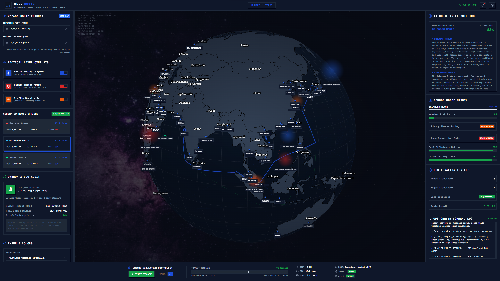

  

# 🌊 BlueRoute

AI-powered Maritime Route Intelligence Platform built for intelligent sea route planning.

## 🚀 Live Demo

https://blue-route-sandy.vercel.app

---

## Problem

Traditional maritime navigation tools provide raw route data but do not explain why a route is safer or more efficient.

BlueRoute solves this by combining maritime datasets, weather intelligence, piracy monitoring and AI-powered route reasoning.

---

## Features

- Intelligent Route Planning
- Global Port Network
- Maritime Navigation Graph
- Weather-aware Route Analysis
- Piracy Risk Assessment
- AIS Vessel Intelligence
- Carbon Emission Estimation
- AI Route Briefing using ASI:ONE
- Interactive 3D Globe

---

## AI Integration

BlueRoute uses **ASI:ONE** as the primary AI reasoning engine.

The AI analyzes:

- Route information
- Weather conditions
- Piracy threats
- Navigation risks
- Route efficiency

It then generates an intelligent operational briefing explaining why the selected route is recommended.

---

## Tech Stack

- Next.js
- TypeScript
- Three.js
- React
- Globe.gl
- AISStream API
- ASI:ONE API

---

## Future Scope

- Live Vessel Tracking
- Live Weather Forecast
- ETA Prediction
- Fleet Analytics
- Port Congestion Detection
- Fuel Optimization

---

## Developed By

Dashrath Saini
